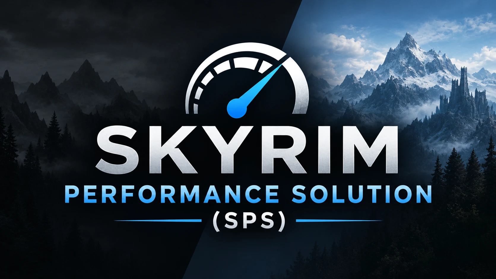

# Skyrim Performance Solution (SPS)



SKSE plugin that makes **Skyrim Special Edition / Anniversary Edition** run smoother on heavily modded setups —
without touching a single game file. It cuts draw calls in the shadow passes, removes redundant per-frame engine work
and **streams textures by distance**, so a GPU no longer runs out of VRAM.

Everything can be toggled live in an in-game menu (English / German, follows the game language) and with one hotkey,
so you can compare with and without the plugin at any time.

---

## Features

| Feature | What it does | Default |
|---|---|---|
| **Texture streaming** | Textures of far objects (also behind the camera) are shrunk in VRAM by dropping their top mip levels on the GPU, and reloaded at full size from disk/BSA in the background when you come closer. Files on disk are never changed. UI, maps, LOD, fonts and books are excluded; items in inventory/barter/crafting previews are always shown at full size. | ON, min. 512–1024 px |
| **VRAM budget mode** | Streaming only kicks in when the game uses more than 85 % of the video memory Windows grants it, largest savings first. With enough VRAM (or no high-res texture packs) it does nothing and costs nothing. | ON |
| **VRAM refill** | When usage drops clearly below the threshold (default 10 points), downscaled textures are reloaded at full size again, most needed first, so the VRAM stays as full as useful. | ON |
| **Clothing and armor of characters** | Clothing and armor worn by far NPCs are streamed as well. Distance is measured at the character itself, so sitting or animated NPCs are handled correctly (their bounding volume lags behind). At a busy market about 1 GB less VRAM. | ON |
| **Bodies, faces and hair** *(test)* | Also streams `textures\actors\character` of far characters. Textures that mods create or change at runtime (RaceMenu overlays, skin tint) are never touched. | OFF |
| **RAM buffer** | Texture data that had to be reloaded more than once stays in RAM up to a set size (default 1 GB, slider in the menu). Textures that go back and forth then come from RAM instead of disk — mostly useful with 8K texture packs. Least recently used is dropped first. 0 = off. | 1024 MB |
| **Load at remembered size** | The size a texture needed last time (also in earlier sessions) is passed to the game's DDS loader, so the top mip levels are never read or uploaded. Also applied during loading screens when VRAM was tight shortly before, so the VRAM no longer peaks at ~97 % after a door. | ON |
| **Sun shadow culling** | Small, far objects do not cast sun shadows. Shadow length is taken into account (no culling below 10° sun elevation). | ON |
| **Torch / point light shadow culling** | Small, far objects do not cast shadows from torches and fires. Objects close to the light always keep their shadow; not applied in interiors by default (switch in the menu). | ON (exteriors) |
| **Character shadow culling** | Characters and creatures far away (default 50 m, min. 30 m) do not cast shadows. | ON |
| **Skylighting culling** | Small objects are left out of the Community Shaders skylighting / precipitation occlusion map. | ON |
| **Decal culling** | Footprint-sized decals (radius < 32, e.g. Dynamic Footprints) farther than ~21 m are not drawn. Larger decals such as plaster patches on walls stay. | ON |
| **Shadow instancing** | Identical simple meshes in the sun shadow pass are drawn with one instanced draw call. Small gain, AE only. | OFF |
| **Light assignment throttle** | Moving lights (torches, flickering lights) only re-search the geometry they light when they actually moved — the engine does this for every dynamic light every frame. | ON |
| **Subtree pruning** | Whole scene-graph branches are skipped in the sun shadow and skylighting passes when the branch as a whole already meets the culling rule. Same result, less traversal. | ON |
| **In-game menu** | All switches and sliders via SKSE Menu Framework, English and German, saved automatically. | — |
| **Hotkey** | One key toggles every optimization (default *Page Up*, freely assignable in the menu). | — |
| **Logging & diagnostics** | One summary line per minute in `SPS.log`; every frame over 100 ms is logged with what SPS did in it (`[Hitch]`). The *Analysis logging* switch adds a detailed 10-second report (counters per optimization, VRAM, streaming), and *Log textures under crosshair* writes path and current size of every texture you look at — handy for bug reports. Optional Tracy timeline. | analysis off |

Experimental and **off** by default (known side effects): depth pre-pass culling, main view micro culling, far shadow
cascade cache.

## Numbers and facts

Measured on the author's setup: Ryzen 7 5700X, RTX 4070 12 GB, 1920×1200, Skyrim AE 1.6.1170, ~380 plugins,
Community Shaders with DLSS + frame generation, Skyrim 202X 4K textures. Location: Whiterun market.

### Texture streaming

| | Streaming OFF | Streaming ON |
|---|---|---|
| Skyrim dedicated VRAM (outside a town) | 9.9 GB | **5.4 GB** |
| Skyrim dedicated VRAM (Whiterun market) | ~10.5 GB + up to 600 MB swapped to system RAM | **5.4 GB**, ~45 MB swapped |
| Downscaled textures (market) | — | ~1,300 textures: **0.33 GB instead of 7.0–7.9 GB** |
| Visible quality difference | — | none noticed in A/B screenshots |
| Reload to full size | — | ~10 ms per texture, 4–4.5 GB in ~8 s, **0 errors in > 30 GB reloaded** |
| Cost of the scene scan | — | ~0.4 ms per frame (time-sliced) |

### Dragonsreach (interior, VRAM full)

Same spot, optimizations toggled with the hotkey, 10-second windows:

| | Optimizations OFF | Optimizations ON |
|---|---|---|
| VRAM usage | 95–98 % | **72–73 %** |
| Swapped to system RAM | up to **1.2 GB** | ~50 MB (after Windows reclaims it) |
| FPS | 27–33 | **41–42** |
| Longest frame | **190–280 ms** stutters | ~35 ms |

### Long session (40 min, 0.22.10 / 0.23.0)

| | |
|---|---|
| Texture load errors | **0** |
| VRAM during normal play | 70–82 % (threshold 85 %) |
| Swapped to system RAM | ~50 MB baseline |
| VRAM right after a loading screen | 69–82 % (before 0.23.0: up to 97 %) |
| Textures loaded directly at reduced size per loading screen | 800–900 |

### Engine work and draw calls

| Optimization | Before | After |
|---|---|---|
| Light assignment (dynamic lights, market) | 2.45 ms / frame | **0.13–0.18 ms / frame** |
| Subtree pruning, sun shadow accumulation | — | **−0.7 to −0.8 ms / frame** (~950 nodes skipped) |
| Subtree pruning, skylighting / precipitation map | 1.51 ms | **1.28–1.39 ms** (~1,700 nodes skipped) |
| Sun shadow culling (midday, market) | 11,210 draws | **8,578 draws** |
| Skylighting culling (radius 128) | ~1,100 objects | **~40 % fewer** |
| All draw-call optimizations together | — | **−26 % draw calls** |

Why shadows matter: in the Whiterun market roughly two thirds of all ~15,000–20,000 draw calls per frame are shadow
and depth passes, and sun shadows alone cost ~12–14 ms of CPU time per frame.

## Requirements

| Dependency | Required | Notes |
|---|---|---|
| Skyrim **SE 1.5.97** or **AE 1.6.x / 1.7.x** | yes | Tested in game on 1.6.1170. Engine patch sites verified against the game code of 1.5.97, 1.6.640, 1.6.1179 (GOG) and 1.7.104. Every engine patch also checks the game code at its location at startup; if it differs, only that function is switched off (listed in the menu and the log). On SE 1.5.97 'shadow instancing' and the main camera timing are off. Older SE versions and VR are not supported. |
| [SKSE64](https://skse.silverlock.org/) | yes | Matching your game version. |
| [Address Library for SKSE Plugins](https://www.nexusmods.com/skyrimspecialedition/mods/32444) | yes | |
| [SKSE Menu Framework](https://www.nexusmods.com/skyrimspecialedition/mods/120352) | optional | In-game menu. Without it, everything is configured in `SPS.ini`. |
| [Community Shaders](https://www.nexusmods.com/skyrimspecialedition/mods/86492) | optional | Skylighting culling only has an effect with CS skylighting. |

## Skyrim VR (beta)

A separate build for **Skyrim VR 1.4.15** (`SPS-VR-<version>.zip`, own Nexus file). It contains the **texture streaming
only** (budget mode, refill, load at remembered size, RAM buffer). The shadow, draw-call and engine features are not
active in VR yet - VR renders differently and they are not verified there. Install only one of the two files.

| VR dependency | Required | Notes |
|---|---|---|
| Skyrim VR **1.4.15** | yes | |
| [SKSEVR](https://skse.silverlock.org/) | yes | 2.0.12 |
| [VR Address Library for SKSEVR](https://www.nexusmods.com/skyrimspecialedition/mods/58101) | yes | |

Settings via `SPS.ini` (SKSE Menu Framework is not available for VR), hotkey *Page Up*. Log:
`Documents\My Games\Skyrim VR\SKSE\SPS.log`. Building: `build.cmd vr` and `powershell -File package.ps1 -Vr`.

## Tips

- **Short hitches when walking through doors** are usually the autosave on travel together with RaceMenu, whose
  co-save serialization can take ~1 s with many presets/morphs. Turning off *Save on travel* in the game settings
  removes them. SPS does not change this.
- To compare, press the hotkey: a message top left shows *optimizations ON/OFF*. Switching streaming off reloads all
  textures at full size, which takes a few seconds and briefly raises VRAM.

## Installation

> **Updating from SkyrimPerf (≤ 1.0.0):** the mod was renamed. Remove the old *SkyrimPerf* mod before installing SPS. Your menu settings and remembered texture sizes are taken over automatically on first start.

1. Download `SPS-<version>.zip` from [Releases](../../releases).
2. Install it with your mod manager (Vortex / MO2) like any other mod.
3. In game: open the SKSE Menu Framework menu → *Skyrim Performance Solution*. The log is written to
   `Documents\My Games\Skyrim Special Edition\SKSE\SPS.log`.

Settings: `Data\SKSE\Plugins\SPS.ini` holds the defaults; changes made in the menu go to
`SPS_User.ini` (only values that differ from the defaults). *Reset to defaults* in the menu deletes that file.

## Building from source

Requirements: Visual Studio 2022 Build Tools (C++), [vcpkg](https://github.com/microsoft/vcpkg) in `C:\dev\vcpkg`.

```bat
git clone --recursive https://github.com/dnai92/skyrimPerformanceSolution.git
cd skyrimPerformanceSolution
build.cmd
powershell -File package.ps1
```

Result: `dist\SPS-<version>.zip`.

| Build dependency | Source |
|---|---|
| CommonLibSSE-NG | git submodule (`extern/CommonLibSSE-NG`) |
| Tracy 0.14.1 | git submodule (`extern/tracy`), on-demand profiling |
| SKSE Menu Framework | runtime only, own binding in `src/MenuApi.h` |
| Detours, DirectXMath, DirectXTK, fmt, spdlog, SimpleIni, xbyak, nlohmann-json, rapidcsv, toml11 | vcpkg (`vcpkg.json`) |

## Support

If SPS helps your game run better, you can buy me a coffee on [Ko-fi](https://ko-fi.com/dani9281660). Thank you!

## License

[GPL-3.0](LICENSE) with the [modding exception](EXCEPTIONS.md). Copyright © 2026 dnai92.

The modding exception only allows SPS to work together with Skyrim, SKSE, Windows and hardware SDKs; it follows the
license of CommonLibSSE NG, which SPS is built on.

Please link to the official Nexus Mods page instead of re-uploading the mod. If you redistribute or modify it,
the GPL requires you to keep the copyright notices, credit the original and publish your changes as source code under
the same license.

---

[](https://ko-fi.com/dani9281660)

SPS is completely free. If you enjoy the mod and want to support its development, voluntary donations are appreciated and help cover development costs such as AI/API services.
